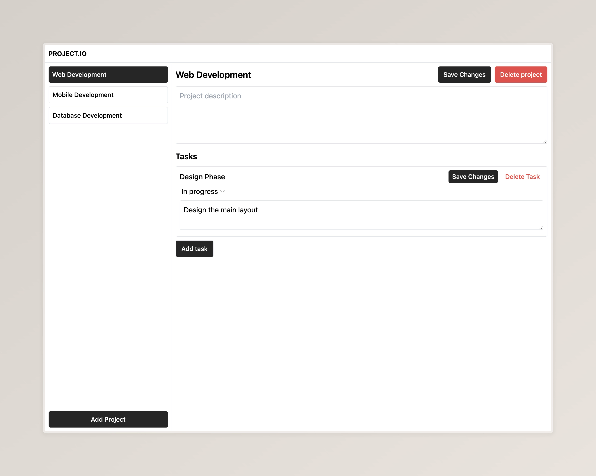

### API Documentation



### Instructions

As part of this interview, you're tasked with implementing a small project management interface. Below are the steps and features we'd like you to focus on:

1. **Clone the Repository**: Start by cloning the provided GitHub repository to your local machine.
2. **Create a New Branch**: Before you start making changes, create a new branch for your work. This branch will be used to assess your contribution.
3. **Display Projects**: Implement a UI that displays a list of projects retrieved from the API. Place this list in a panel on the left side of your application.
4. **Project Details**: When a user clicks on a project in the list, fetch and display the project's details, including its tasks, on the right panel.
5. **Add Projects**: Include a feature to add new projects through the interface, making a POST request to the `/projects` endpoint.
6. **Edit/Delete Projects**: Allow users to edit and delete projects using the PUT and DELETE methods on the `/projects/{projectId}` endpoint.
7. **Edit/Delete Tasks**: Similar to projects, enable editing and deleting tasks within a project. This requires interaction with the `/projects/{projectId}/tasks/{taskId}` endpoint.
8. **Loading UI**: Implement a loading indicator that appears while data is being fetched from the API, enhancing the user experience.

Please ensure your application handles these operations effectively, reflecting changes in the UI immediately after any add, edit, or delete operation.

#### API Interaction

Refer to the API documentation provided in the earlier section to understand how to interact with the backend for fetching, creating, updating, and deleting projects and tasks. Your implementation should make use of the API endpoints documented there.

---

#### Base URL

```
http://127.0.0.1:8000
```

#### Projects

- **List All Projects**

  - **Method:** GET
  - **Endpoint:** `/projects`
  - **Description:** Retrieves a list of all projects.

- **Create a New Project**
  - **Method:** POST
  - **Endpoint:** `/projects`
  - **Description:** Creates a new project.
  - **Body:**
    ```json
    {
      "projectName": "New Project"
    }
    ```

#### Specific Project

- **Retrieve a Project**

  - **Method:** GET
  - **Endpoint:** `/projects/{projectId}`
  - **Description:** Retrieves details of a specific project by `projectId`.

- **Update a Project**

  - **Method:** PUT
  - **Endpoint:** `/projects/{projectId}`
  - **Description:** Updates the specified project.
  - **Body:**
    ```json
    {
      "projectName": "Updated Project Name"
    }
    ```

- **Delete a Project**
  - **Method:** DELETE
  - **Endpoint:** `/projects/{projectId}`
  - **Description:** Deletes the specified project.

#### Tasks within a Project

- **List All Tasks in a Project**

  - **Method:** GET
  - **Endpoint:** `/projects/{projectId}/tasks`
  - **Description:** Retrieves all tasks within a specific project.

- **Add a Task to a Project**
  - **Method:** POST
  - **Endpoint:** `/projects/{projectId}/tasks`
  - **Description:** Adds a new task to a project.
  - **Body:**
    ```json
    {
      "title": "New Task",
      "description": "Task description",
      "status": "Pending",
      "assignees": ["Dev A", "Dev B"],
      "dueDate": "2024-12-31"
    }
    ```

#### Specific Task in a Project

- **Retrieve a Task**

  - **Method:** GET
  - **Endpoint:** `/projects/{projectId}/tasks/{taskId}`
  - **Description:** Retrieves details of a specific task within a project.

- **Update a Task**

  - **Method:** PUT
  - **Endpoint:** `/projects/{projectId}/tasks/{taskId}`
  - **Description:** Updates the specified task within a project.
  - **Body:**
    ```json
    {
      "title": "Updated Task Title",
      "status": "Completed"
    }
    ```

- **Delete a Task**
  - **Method:** DELETE
  - **Endpoint:** `/projects/{projectId}/tasks/{taskId}`
  - **Description:** Deletes the specified task from a project.

Replace `{projectId}` and `{taskId}` with the actual IDs of the project and task you intend to manipulate.
