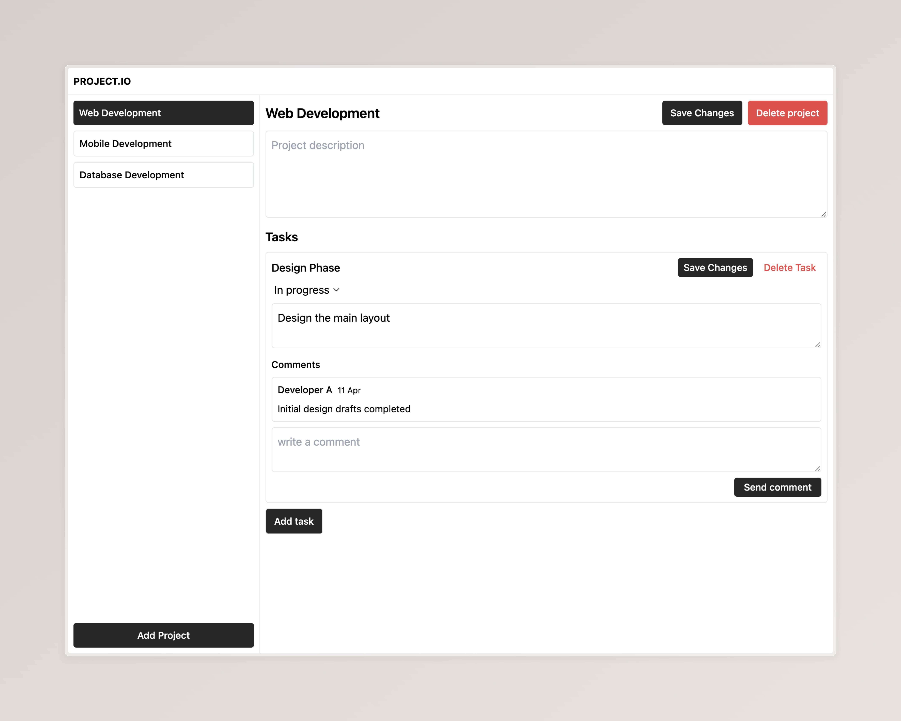

### API Documentation



Welcome to the Project Management API. This document briefly guides you on how to interact with the API to perform various operations related to projects and tasks.

#### Base URL

```
http://127.0.0.1:8000
```

#### Projects

- **List All Projects**

  - **Method:** GET
  - **Endpoint:** `/projects`
  - **Description:** Retrieves a list of all projects.

- **Create a New Project**
  - **Method:** POST
  - **Endpoint:** `/projects`
  - **Description:** Creates a new project.
  - **Body:**
    ```json
    {
      "projectName": "New Project"
    }
    ```

#### Specific Project

- **Retrieve a Project**

  - **Method:** GET
  - **Endpoint:** `/projects/{projectId}`
  - **Description:** Retrieves details of a specific project by `projectId`.

- **Update a Project**

  - **Method:** PUT
  - **Endpoint:** `/projects/{projectId}`
  - **Description:** Updates the specified project.
  - **Body:**
    ```json
    {
      "projectName": "Updated Project Name"
    }
    ```

- **Delete a Project**
  - **Method:** DELETE
  - **Endpoint:** `/projects/{projectId}`
  - **Description:** Deletes the specified project.

#### Tasks within a Project

- **List All Tasks in a Project**

  - **Method:** GET
  - **Endpoint:** `/projects/{projectId}/tasks`
  - **Description:** Retrieves all tasks within a specific project.

- **Add a Task to a Project**
  - **Method:** POST
  - **Endpoint:** `/projects/{projectId}/tasks`
  - **Description:** Adds a new task to a project.
  - **Body:**
    ```json
    {
      "title": "New Task",
      "description": "Task description",
      "status": "Pending",
      "assignees": ["Dev A", "Dev B"],
      "dueDate": "2024-12-31"
    }
    ```

#### Specific Task in a Project

- **Retrieve a Task**

  - **Method:** GET
  - **Endpoint:** `/projects/{projectId}/tasks/{taskId}`
  - **Description:** Retrieves details of a specific task within a project.

- **Update a Task**

  - **Method:** PUT
  - **Endpoint:** `/projects/{projectId}/tasks/{taskId}`
  - **Description:** Updates the specified task within a project.
  - **Body:**
    ```json
    {
      "title": "Updated Task Title",
      "status": "Completed"
    }
    ```

- **Delete a Task**
  - **Method:** DELETE
  - **Endpoint:** `/projects/{projectId}/tasks/{taskId}`
  - **Description:** Deletes the specified task from a project.

Replace `{projectId}` and `{taskId}` with the actual IDs of the project and task you intend to manipulate.
